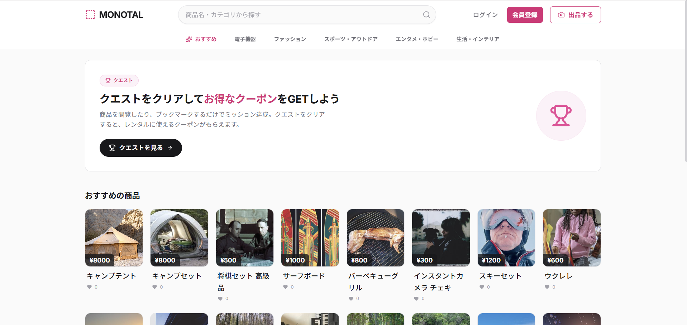
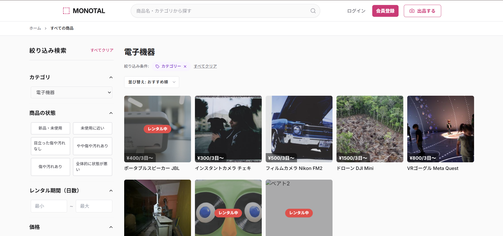
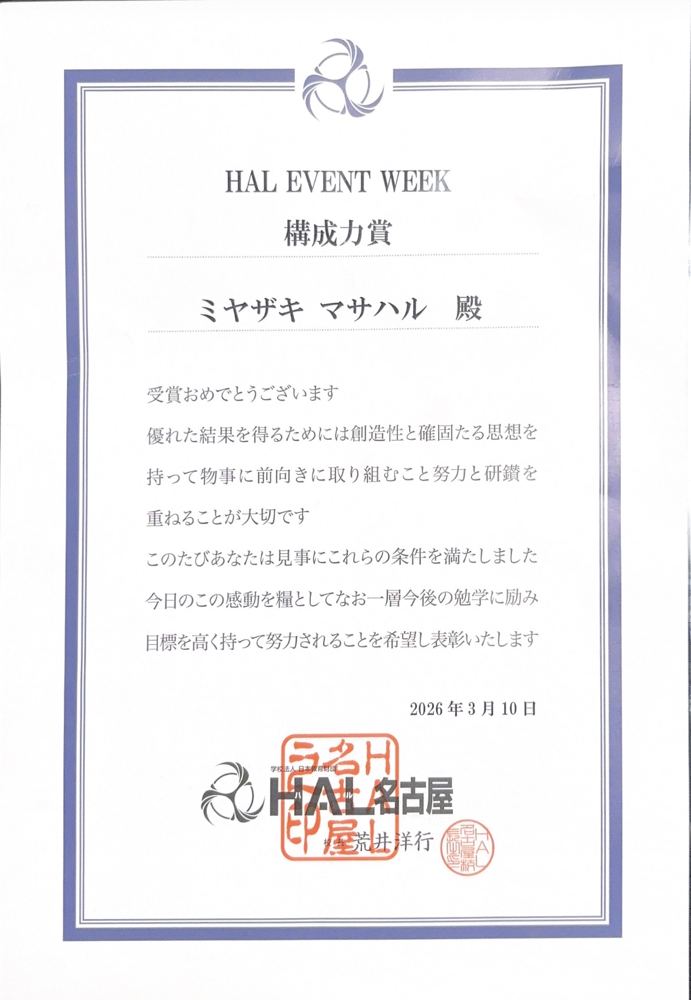

# MONOTAL（モノタル）

使うときだけ、必要なものを。」モノの貸し借りでつながるレンタルマーケットプレイスアプリ

## スクリーンショット

| ホーム画面                                  | 商品一覧画面                                  |
| ------------------------------------------- | --------------------------------------------- |
|  |  |

---

## 受賞歴

**HAL名古屋 進級制作展（HALイベントウイーク）「構成力賞」受賞**

  

本プロジェクトは、HAL名古屋の進級制作展にて、チームリーダーとして開発を牽引し「構成力賞」を受賞した作品です。

開発中盤、大幅なスケジュール遅延に直面した際は、一人で抱え込むのではなく、まずメンバー全員で課題を共有する場を設けまし
た。そこで出た意見をもとに「技術が得意なメンバーが遅れている工程のサポートに回る」など、全員が納得でき、かつ個々の強み
を活かせる体制へ柔軟に再編成。結果としてチームの一体感と生産性が向上し、最終的に質の高い作品を完成させ、受賞という成果
につながりました。

---

## 開発アプローチ（Claudeの活用について）

本プロジェクトでは、開発効率と学習効果の両立を目指し、AIアシスタント「Claude」を活用しながら開発を進めました。役割分担
は以下の通りです。

- **チームで担当した領域**：システム定義、DB設計、処理フロー設計、画面修正、問題解決
  　→ サービスの根幹となる設計判断や、要件に応じた仕様の調整・トラブルシューティングは、自分たちの手で考え抜いて実装
- **Claudeを活用した領域**：フロントエンド（画面）の実装、view（Web API）の実装
  　→ 設計・要件をもとにした実装部分でAIを活用することで、開発スピードを高めつつ、コア部分の設計や品質管理に集中できる
  体制を整えました

「丸投げ」ではなく「設計は自分たちで行い、実装の一部をAIで加速する」という分業によって、限られた制作期間の中でも機能の
幅と完成度を両立させることができました。

　---

## システム概要

MONOTALは、個人間でモノを「貸す・借りる」ことに特化したレンタルマーケットプレイスのWebアプリケーションです。Django（Python）
で構築され、出品から発送・返却・評価までのレンタル取引の一連の流れを、安心・安全に完結できる仕組みを提供します。

単なる物の売買ではなく「一時利用」に焦点を当てることで、所有することへのハードルを下げ、モノを介したユーザー同士のコミ
ュニケーションも生まれる場を目指しています。

---

## 主な機能

### マーケットプレイス

- 商品の出品・検索・閲覧（カテゴリ別、キーワード検索、オートコンプリート対応）
- 商品ごとに複数のレンタルプラン（日数×料金）を設定可能
- お気に入り（ブックマーク）・閲覧履歴・出品者フォロー（新着通知付き）

### レンタル取引フロー

- レンタル申請 → 承認/却下 → 発送 → 受取 → 利用 → 返却 → 評価、までを一気通貫管理
- 配送・返送の追跡番号入力、返却期限管理
- キャンセル申請、返品申請（承認・却下・返金）など、トラブル時の手続きにも対応
- レンタル終了後の相互レビュー・評価機能

### コミュニケーション

- ユーザー間チャット、商品に紐づくチャット、取引専用チャット、コミュニティチャット
- 画像添付、商品リンク共有、返信（リプライ）スレッド、既読管理

### コミュニティ・Q&A・ゲーミフィケーション

- 興味カテゴリ別のコミュニティ／掲示板
- Q&A機能（質問・回答・ベストアンサー選定、カテゴリ・ステータス管理）
- クエスト機能（ミッションクリアでクーポン獲得、難易度別チュートリアル〜上級）

### 安心・安全のための仕組み

- 本人確認（身分証画像アップロード）、メール認証、ソーシャルログイン（Google連携）
- フォロー／ブロック／通報機能、利用規約・違反管理
- レンタル保険（加入・解約・補償申請）、銀行口座・クレジットカード管理
- 通知センター（システム／メッセージ／レンタル／コミュニティを一元管理）

---

## 解決している課題

- **「欲しいけど、頻繁には使わない」モノの所有コスト**：購入するほどではないが時々使いたいアイテムを、必要な期間だけ低
  コストで利用できる
- **個人間取引の信頼性不足**：本人確認・レビュー・通報・ブロックなどの仕組みにより、知らない相手とでも安心して取引でき
  る環境を構築
- **取引中のコミュニケーション不全によるトラブル**：取引専用チャットや通知センターにより、貸主・借主間の連絡漏れや認識
  齟齬を防止
- **継続利用のモチベーション維持**：クーポンやクエストといったゲーミフィケーション要素により、アプリへの定着と能動的な
  利用を促進

---

## 工夫している点

- **きめ細かいステータス管理**：レンタル取引は「発送準備中→配送中→レンタル中→返送中→返却済み」を含む12段階のステータス
  で管理し、キャンセル・返品申請・中止申請といった例外フローも明確に状態遷移として設計
- **取引履歴の保全設計**：取引完了後にユーザーや商品が削除されても記録が消えないよう、履歴系テーブルは外部キー制約に`P
ROTECT`を採用し、監査性・トレーサビリティを担保
- **論理削除（ソフトデリート）の採用**：ユーザーや商品の削除時にも、関連する取引データの整合性が崩れないよう`is_delete
d`フラグや削除日時で管理
- **マルチチャット基盤**：ユーザー間・商品紐づけ・コミュニティ・取引専用という4種類のチャットルームを共通基盤上に統一
  し、画像添付やリプライなど共通機能を再利用可能に設計
- **システムの予測問題解決**レンタルシステムの予測問題を事前に考慮し、ユーザーとして安心して使えるようなシステム設計の作成

---

## レンタルアプリとして考えた問題点対策

レンタルサービス特有の「貸したものが返ってこない」「商品が壊れて返却された」「取引相手と連絡が取れない」といった不安に
対し、以下の対策を講じています。

| 想定される問題                   | 対策                                                                               |
| -------------------------------- | ---------------------------------------------------------------------------------- |
| 借主が商品を返却しない／延滞する | 返却期限の明示、返却ステータスの可視化、運営による違反履歴の管理                   |
| 貸し借り中に商品が破損・紛失する | レンタル保険の加入・補償申請フロー、画像証跡付きの保険金請求機能                   |
| 取引相手が信頼できるか分からない | 本人確認（身分証提出）、ユーザーレビュー、フォロー／ブロック／通報機能             |
| 配送状況が分からず不安になる     | 発送・返送それぞれの追跡番号入力欄、取引専用チャットでのリアルタイム連絡           |
| 取引中にトラブルが発生する       | キャンセル申請・返品申請（承認/却下/返金）など、状況に応じた中断・修正フローを用意 |

---

## 技術スタック

    カテゴリ     技術・ライブラリ

バックエンド ： Python / Django
フロントエンド ： HTML / CSS / JavaScript
データベース ： SQLite（開発環境）
認証 ： Django 標準認証 / Google OAuth
バージョン管理 ： Git / GitHub

---

## 工夫すればよかった点

- **GitHubブランチ戦略の徹底**：機能単位でブランチ（`feat/xxx`）を作成し、レビュー・確認後にmainへPRしてマージするワークフローを今後の作品から実践する。本作品では単一ブランチで開発を進めた部分があり、変更履歴の追跡や機能の切り戻しがしづらかった。

---

## 利用フロー

### 借りる側（購入者）のフロー

1. 会員登録・本人確認・興味カテゴリ選択
2. 商品検索・カテゴリ閲覧、気になる商品をブックマーク
3. レンタルプラン（期間・料金）を選択して申請
4. 出品者の承認後、住所・支払い方法を選択して取引開始
5. 取引専用チャットで連絡を取りながら商品を受取
6. 利用後、追跡番号を控えて返送
7. 返却完了後、出品者を評価してレビュー投稿

### 貸す側（出品者）のフロー

1. 本人確認・銀行口座登録（出品の前提条件）
2. 商品情報・画像・複数のレンタルプラン（日数×料金）を登録
3. レンタル申請を確認し、承認または却下
4. 取引開始後、発送準備・追跡番号の入力・発送
5. 取引専用チャットで借主とやり取り
6. 商品の返却を確認し、状態をチェック
7. 借主を評価し、必要に応じて保険金請求などの対応
